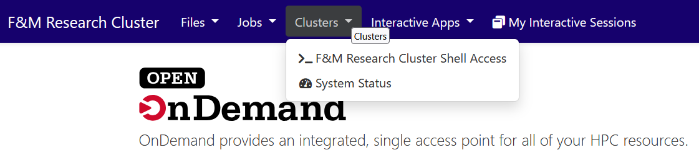

{: .note }
>  This guide is meant for users who in the past, had generally accessed the cluster
>  using SSH and the command line.
>

# Accessing a terminal

The easiest/fastest way to continue working with the cluster through OOD is to open
a terminal by selecting

- **Clusters**
- **F&M Research Cluster Shell Access**

{: .warning }
>  You should not use the terminal for any long running commands (e.g., scp/rsync, monitoring log files, etc.)
>  because of the potential for timeouts due to inactivity
>

# Transferring files

For complete details on transferring files to/from the cluster please refer to 
[file upload/download documentation](file_upload.html).  In brief,

- Use OOD's file manager (**Files-->Home Directory**) to upload/download files up to 10GB in size

- If you routinely work with larger files, then in all likelihood we have large network storage
  on the cluster for your research.  You should move files to that however you normally might
  do that (e.g., via Globus).  You can then either use the terminal(and Linux commands) or the File Manager to 
  copy files between the network storage and your home directory on the cluster.

